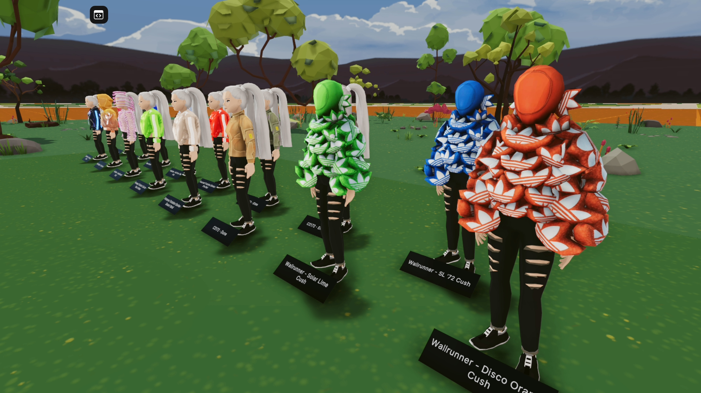
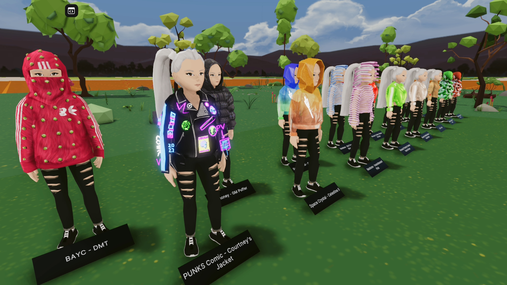
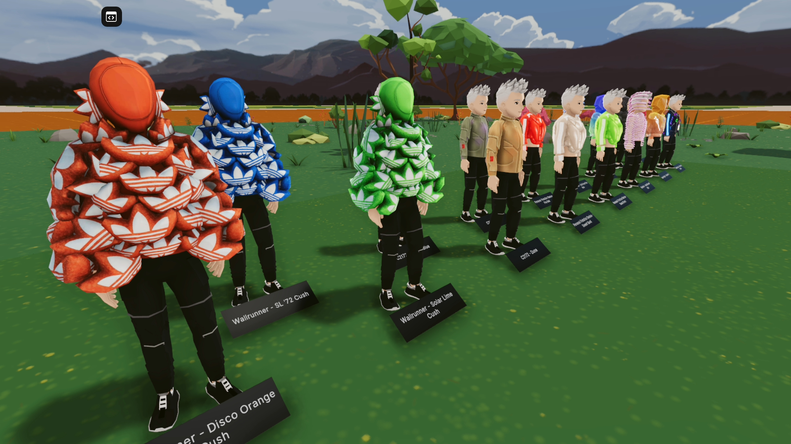
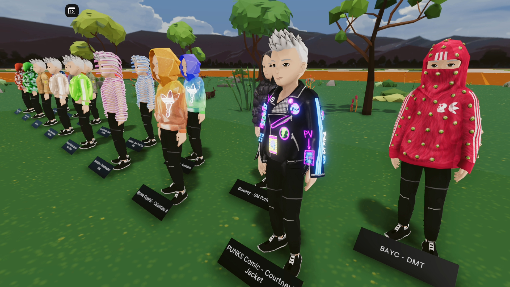

# Decentraland scene

Decentraland scene displaying Adidas Virtual Gear - Genesis Collection linked wearables on NPC avatars. This scene is built with the SDK7.






## Try it out

**Previewing the scene**

1. Download this repository.

2. Install the [Decentraland Editor](https://docs.decentraland.org/creator/development-guide/sdk7/editor/)

3. Open a Visual Studio Code window on this scene's root folder. Not on the root folder of the whole repo, but instead on this sub-folder that belongs to the scene.

4. Open the Decentraland Editor tab, and press **Run Scene**

Alternatively, you can use the command line. Inside this scene root directory run:

```
npm run start
```

## Copyright info

This scene is protected with a standard Apache 2 licence. See the terms and conditions in the [LICENSE](/LICENSE) file.
